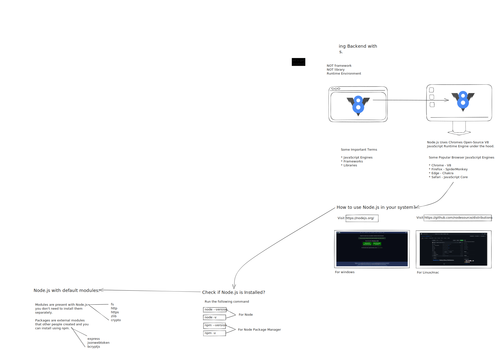

# Session 1 - Getting Started with Backend (Node)

    

## Resources Used

1. [JavaScript Execution Context – How JS Works Behind The Scenes](https://www.freecodecamp.org/news/execution-context-how-javascript-works-behind-the-scenes/)
2. [Web APIs | MDN](https://developer.mozilla.org/en-US/docs/Web/API)
3. [Introduction to Node.js](https://nodejs.dev/en/learn)
4. [npm](https://www.npmjs.com/)

## What we covered?

- What is backend development?
- It's usecase.
- What we will learn in the upcoming sessions?
- What is Node.js? Installing Node.js.
- Checking if Node.js is installed.
- Differneces between Modules and Packages.
  - A better explaination is here - <https://stackoverflow.com/questions/20008442/difference-between-a-module-and-a-package-in-node-js>

**Notion Page:** <https://kunal-keshan.notion.site/Getting-Started-with-Backend-Node-af73a67815f6496482f21de4ae33b1e4?pvs=4> - Refer for additional information.
