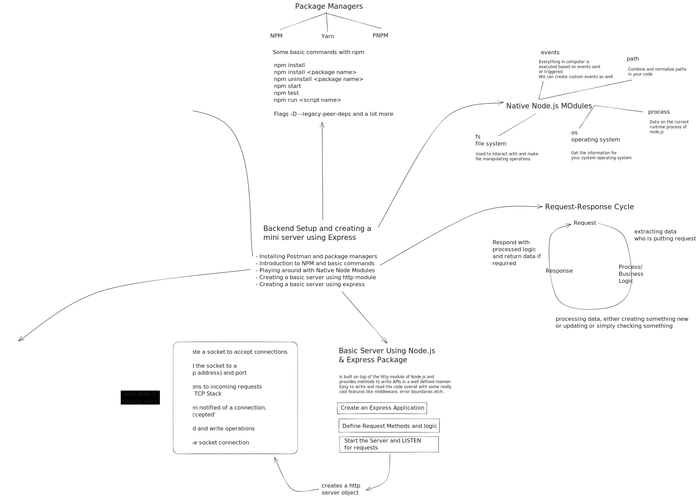

# Session 2 - Backend Setup and creating a mini server using Express

    

## Installing Postman

- Postman is a popular API development and testing tool. You can download and install it from the official website: [Postman](https://www.postman.com/downloads/)

## Package Managers

- Package managers are tools that help manage dependencies and libraries in a project. Two commonly used package managers for Node.js are npm and Yarn.
  - Learn about npm: [npm documentation](https://docs.npmjs.com/)
  - Learn about Yarn: [Yarn documentation](https://yarnpkg.com/getting-started)
  - Learn about Pnpm: [Pnpm documentation](https://pnpm.io/motivation)

## Native Node.js Modules

- Node.js provides several built-in modules that can be used without installing any external dependencies. Some commonly used native modules include `fs`, `path`, `http`, and `util`.
  - Explore native Node.js modules: [Node.js API documentation](https://nodejs.org/api/)

## Request-Response Cycle

- The request-response cycle is the flow of communication between a client and a server. It involves the client making a request to the server, and the server responding with the requested data.
  - Understand the request-response cycle: [MDN Web Docs - HTTP overview](https://developer.mozilla.org/en-US/docs/Web/HTTP/Overview)

## Creating a Server using http module

- The `http` module in Node.js allows you to create a basic HTTP server. It provides functions to handle incoming requests and send responses.
  - Learn how to create a server using the `http` module: [Node.js HTTP documentation](https://nodejs.org/api/http.html#http_http_createServer_options_requestlistener)

## Creating a Server using Express

- Express is a popular web application framework for Node.js. It simplifies the process of building web servers and APIs by providing a higher-level abstraction.
  - Get started with Express: [Express.js documentation](https://expressjs.com/)

## Resources

- [What does the .listen() method in express look like?](https://stackoverflow.com/a/70386667/14187429)