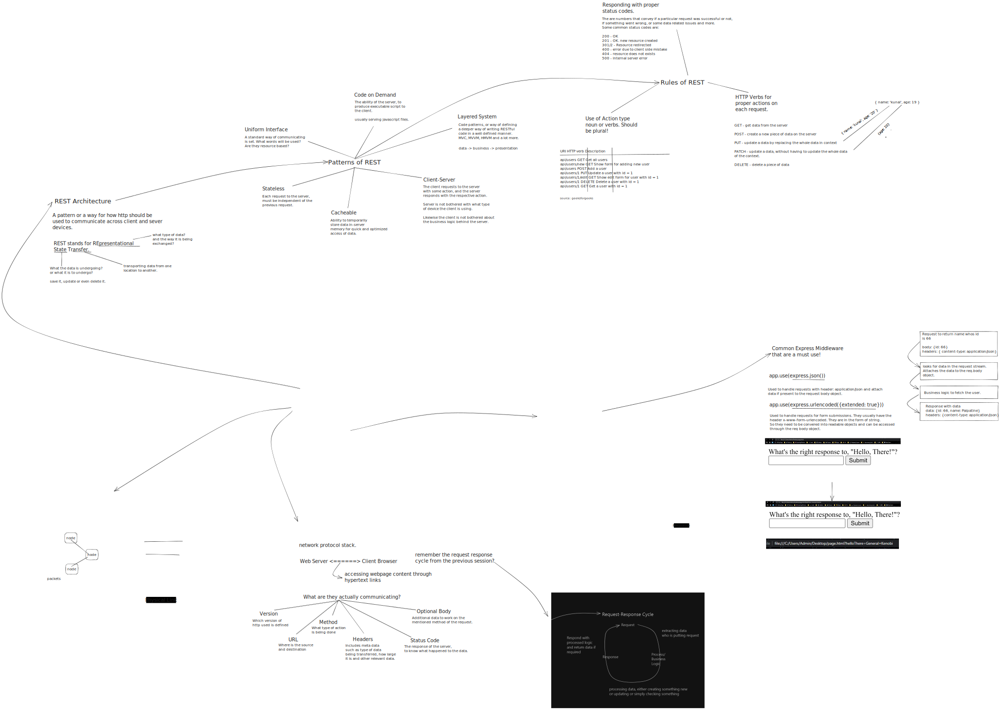

## Session 3 - Creating RESTful APIs

    

## OCI System

The OCI (Object-Call Interface) layer is an important part of a computer system that helps different parts of the system communicate and share information. It acts as a bridge between the software running on a computer and the hardware components of the system.

At the heart of the OCI layer is the idea of objects. Objects are like containers that hold information or perform specific tasks. They can represent things like files, folders, or processes. The OCI layer provides a way for software programs to create, access, and manage these objects. It defines a set of rules and commands that programs can use to interact with the objects.

The OCI layer also handles the flow of data within the system. It ensures that information can be passed from one object to another and that the right objects receive the data they need. It manages the routing and delivery of data, making sure it reaches the correct destination. This flow of data is essential for the overall functioning of the computer system.

In summary, the OCI layer acts as a communication and data management system within a computer. It enables software programs to interact with objects and facilitates the flow of data between different parts of the system. Without the OCI layer, software programs would have a difficult time accessing and utilizing the hardware resources of the computer.

## What is HTTP?

HTTP is like a messenger that helps computers talk to each other. It's a set of rules and commands that computers use to request and send information over the internet. It's like sending letters to ask for things or share information with others.

## Middlewares in Express

Middlewares in Express are like helpers that assist in processing requests and responses. They can do various tasks, like converting data to a specific format or adding extra information. For example, .json middleware helps convert data to JSON format, while .urlencoded middleware helps process form data. We can also create custom middlewares to perform specific actions during the request-response cycle.

## What is REST?

REST is a way of organizing and designing APIs to make them easy to understand and use. It stands for Representational State Transfer. Think of it as a set of rules and guidelines for creating APIs that work well together. It's like having a recipe for making delicious food!

## REST Patterns

REST patterns are like blueprints for building APIs. They provide common ways to structure and organize API endpoints, making it easier for developers to understand and use them. It's like following a step-by-step guide to build something amazing!

## REST Rules

REST has a set of rules to follow when designing APIs. These rules ensure that APIs are consistent, reliable, and easy to work with. Some rules include using standardized HTTP methods (like GET, POST, etc.), having unique URLs for each resource, and providing meaningful responses. Following these rules makes APIs better for everyone.

## Difference between HTTP vs REST

HTTP and REST are related but serve different purposes. HTTP is a protocol for communication between computers, while REST is a design approach for building APIs. HTTP is like the language computers use to talk, and REST is like the framework that helps structure and organize those conversations.

## Resources

- [Differene Between HTTP & REST](https://stackoverflow.com/a/32796779/14187429)
- [What is HTTP?](https://www.cloudflare.com/en-in/learning/ddos/glossary/hypertext-transfer-protocol-http/)
- [REST Architecture](https://www.geeksforgeeks.org/rest-api-architectural-constraints/)
- [Writing Middlewares in Express](https://expressjs.com/en/guide/writing-middleware.html)
