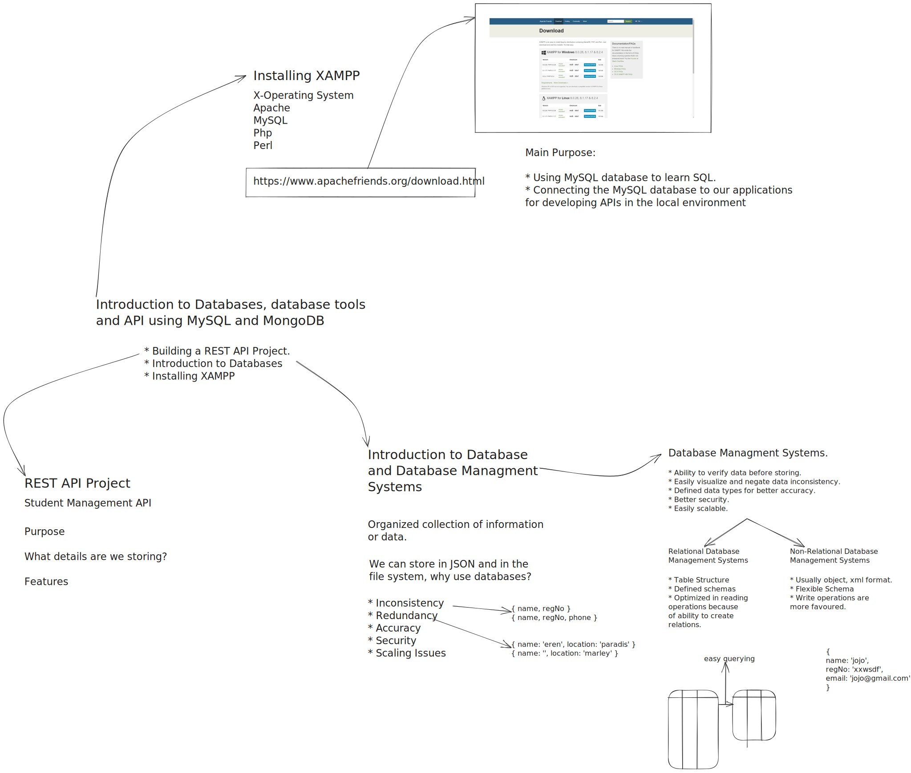

# Session 4 - REST API Project & Introduction to Databases

This repository contains a simple project that demonstrates the implementation of a RESTful API for a student management system. It allows you to perform CRUD operations (Create, Read, Update, Delete) on student records using HTTP endpoints. The API provides functionality to create a new student, retrieve all students, retrieve a student by registration number, update a student's name by registration number, and delete a student by registration number.

## Part 1 - Project and Intro to Databases

    

### Endpoints

- POST /students: Create a new student
- GET /students: Retrieve all students
- GET /students/{regNo}: Retrieve a student by registration number
-PUT /students/{regNo}: Update a student's name by registration number
-DELETE /students/{regNo}: Delete a student by registration number

### How to Use

- Clone this repository to your local machine.
- Install the required dependencies by running npm install.
- Start the server by running npm start.
- You can now send HTTP requests to the specified endpoints to perform CRUD operations on the student records.

### Introduction to Databases

#### What are Databases?

A database is a structured collection of data that is organized and stored in a way that allows efficient retrieval, modification, and management of the data. It serves as a central repository for storing and managing large amounts of information.

#### Why Do We Need Databases?

Databases provide several benefits for managing data:

- Data Persistence: Databases ensure that data is stored persistently, meaning it is preserved even when the application or system is not running. This allows data to be accessed and used across multiple sessions.
- Data Integrity: Databases enforce rules and constraints to maintain the integrity of the stored data, preventing inconsistencies and ensuring its accuracy.
- Data Scalability: Databases can handle large amounts of data and support concurrent access from multiple users, making them suitable for applications with growing data requirements.

#### Advantages of Using DBMS (Database Management Systems)

DBMS is software that allows the creation, management, and manipulation of databases. Some advantages of using DBMS include:

- Data Security: DBMS provides mechanisms to protect sensitive data and control access to the database.
-Data Consistency: DBMS ensures that data remains consistent by enforcing constraints and maintaining relationships between different data elements.
-Data Recovery: DBMS facilitates data backup and recovery mechanisms to prevent data loss in the event of system failures.
-Data Sharing: DBMS enables concurrent access to data, allowing multiple users or applications to access and manipulate data simultaneously.

### Types of Databases

There are two main types of databases:

- Relational Databases Management Systems (RDBMS): Relational databases organize data into tables with rows and columns. They use a structured query language (SQL) to manipulate and retrieve data. RDBMS provides a high level of data integrity and supports complex relationships between tables.
- NoSQL Databases Management Systems (NoSQL DBMS): NoSQL databases are non-relational and provide flexible schemas for storing and retrieving data. They are designed to handle large amounts of unstructured or semi-structured data and offer high scalability and performance.

### Difference between RDBMS and NoSQL DBMS

The main difference between RDBMS and NoSQL DBMS lies in their data models and usage scenarios. RDBMS is suitable for applications with structured and relational data, where data consistency and complex querying are crucial. NoSQL DBMS is ideal for handling unstructured or rapidly changing data, providing high scalability and performance.

### Installing and Setting up XAMPP

XAMPP is a popular software package that provides an environment for running a local web server and managing databases. It simplifies the installation and configuration of Apache, MySQL, PHP, and Perl.

To install and set up [XAMPP](https://www.apachefriends.org/index.html), follow these steps:

- Download the XAMPP installer for your operating system from the official website.
- Run the installer and follow the on-screen instructions to complete the installation process.
- Once installed, start the XAMPP control panel and start the Apache and MySQL services.
- Access the MySQL database using the phpMyAdmin web interface provided by XAMPP.
- With XAMPP set up, you can create and manage databases using MySQL, and integrate them into your applications as needed.

### Resources

Here are some additional resources to further explore the topics covered in this session:

- [Express.js Documentation](https://expressjs.com/)
- [Introduction to Databases - GeeksforGeeks](https://www.geeksforgeeks.org/introduction-to-databases/)
- [Relational Databases vs. NoSQL - GeeksforGeeks](https://www.geeksforgeeks.org/relational-vs-nosql-database/)
- [XAMPP Official Website](https://www.apachefriends.org/index.html)

Feel free to dive into these resources to deepen your understanding of RESTful APIs, databases, and related concepts.

## Part 2 - SQL and MongoDB
