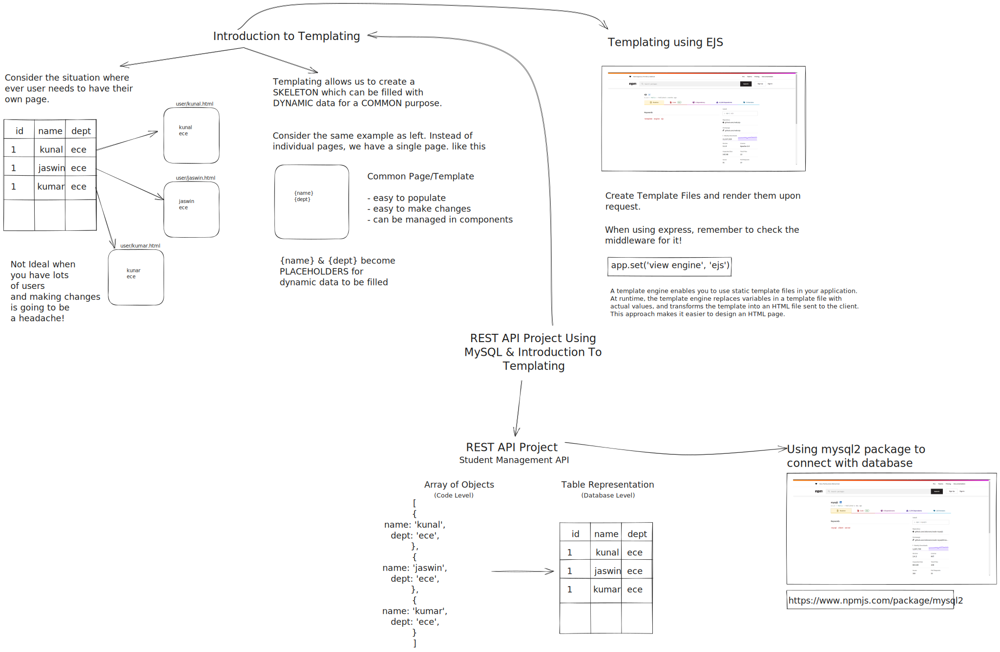

# Session 5 - Introduction to Templating

<p align="center">
    
</p>

This session provides an overview of building a REST API using Node.js and Express, along with using MySQL as the database for a student management system project. Additionally, we introduce the concept of templating and demonstrate how to use the EJS templating engine in Node.js.

## Project Description: Student Management System

The project involves creating a student management system where we store and retrieve student data from a MySQL database. Instead of using an array of objects, we utilize the MySQL2 library to interact with the database and perform CRUD operations (Create, Read, Update, Delete) on student records.

### MySQL2 Library

MySQL2 is a Node.js driver for MySQL that provides an easy and efficient way to connect to a MySQL database and perform database operations. We utilize this library to establish a connection with our MySQL database, execute SQL queries, and handle the results.

## Introduction to Templating

Templating is a technique used to dynamically generate HTML pages by combining HTML structure with data. It allows us to create reusable templates and render them with dynamic content. Templating is particularly useful for generating web pages with dynamic data from the server.

### Why Templating is Required

Templating enables us to separate the presentation logic from the business logic of our application. By using templates, we can maintain a clear separation between the HTML structure and the dynamic data that needs to be injected into the HTML. This separation promotes code reusability, maintainability, and improves overall development efficiency.

### Templating with EJS

EJS (Embedded JavaScript) is a popular templating engine for Node.js that allows us to embed JavaScript code within HTML markup. It provides a simple syntax and powerful features to dynamically generate HTML content based on data from the server.

### EJS Setup

To use EJS in a Node.js project, we need to install the EJS package using npm. We also configure the Express application to use EJS as the view engine. This enables us to render EJS templates and pass data to them for dynamic content generation.

```js
app.set('template engine', 'ejs')
```

### Adding EJS to the Student Management Project

In our student management system project, we incorporate EJS as the templating engine. We create EJS templates that define the structure of our web pages and use EJS syntax to inject dynamic data into the templates. By combining the power of MySQL2 for database operations and EJS for dynamic content rendering, we create a robust and scalable student management system.

## Resources

- [npm: mysql2](https://www.npmjs.com/package/mysql2)
- [npm: ejs](https://www.npmjs.com/package/ejs)
- [Using EJS with Express](https://github.com/mde/ejs/wiki/Using-EJS-with-Express)
- [Using template engines with Express](https://expressjs.com/en/guide/using-template-engines.html)

Please refer to the session materials and code samples for detailed instructions and examples on building the REST API with MySQL database and integrating EJS templating in the student management project.
