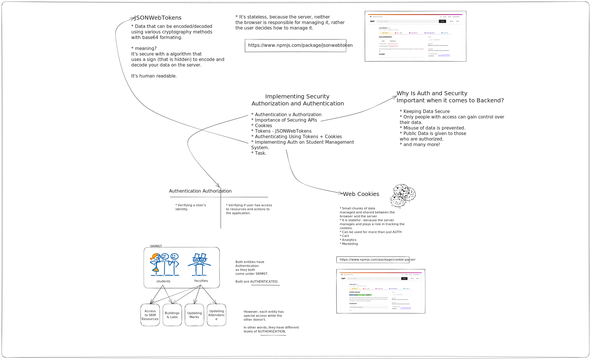

# Session 6 - Authentication & Authorization

    

## Introduction

- Explanation of the session's objectives and the importance of authentication and authorization in web applications.

Authentication and authorization are crucial aspects of web applications. This session aims to provide participants with a deep understanding of these concepts and their importance in ensuring secure access to resources. By implementing proper authentication and authorization mechanisms, developers can safeguard sensitive data and protect against unauthorized access. The session will cover various techniques and tools to achieve secure authentication and authorization.

## Understanding the Basics

- Authentication: Verifying the identity of a user.
- Authorization: Granting or denying access based on user permissions.

Authentication involves verifying the identity of users, ensuring they are who they claim to be. This is typically done by validating credentials, such as usernames and passwords. Authorization, on the other hand, determines what actions or resources a user is allowed to access based on their role or permissions. By understanding these fundamental concepts, participants will gain insights into the essential components of a robust authentication and authorization system.

## The Importance of Secure Authentication

- Risks of leaving APIs exposed without proper authentication and authorization.
- Ensuring secure user authentication to protect sensitive data.

Leaving APIs exposed without proper authentication and authorization mechanisms can lead to severe security vulnerabilities. Unauthorized users may gain access to sensitive information or perform malicious actions. Secure authentication ensures that only authenticated and authorized individuals can access protected resources. Participants will learn about the risks associated with weak authentication practices and understand the significance of implementing strong security measures.

## Implementing Cookies for Authentication

- Introduction to cookies and their role in web authentication.
- Setting up a Node.js and Express server to handle cookies.
- Cookie-based authentication implementation using the student management API.

Cookies play a vital role in web authentication. They are small pieces of data stored on the client-side and are used to track user sessions. In this session, participants will learn how to set up a Node.js and Express server to handle cookies. They will explore how cookies can be used to authenticate and maintain user sessions, allowing for a seamless and secure user experience.

## Introduction to Tokens

- Advantages of tokens over cookies for authentication.
- Purpose and structure of JSON Web Tokens (JWT).

Tokens offer an alternative approach to authentication, providing various advantages over traditional cookies. Participants will understand the benefits of tokens, such as statelessness and scalability. JSON Web Tokens (JWT) are a widely used token-based authentication mechanism. They will learn about the purpose and structure of JWTs, including how they can securely store user-specific data.

## Implementing JSON Web Tokens (JWT)

- Generating and signing JWT tokens in a Node.js and Express server.
- Including user-specific data and setting token expiration.

This topic dives deeper into implementing JWT tokens in a Node.js and Express server. Participants will learn how to generate and sign JWT tokens, ensuring their authenticity and integrity. They will explore the inclusion of user-specific data within JWTs and understand how to set expiration times to enhance security.

## Combining JWT Tokens with Cookies

- Enhancing security and flexibility by combining JWT tokens with cookies.
- Implementing a cookie-based authentication system with JWT tokens.

By combining JWT tokens with cookies, developers can leverage the benefits of both approaches. This topic will cover how to implement a cookie-based authentication system that utilizes JWT tokens for authorization. Participants will discover how this combination enhances security, enables token revocation, and allows for secure cross-origin requests.

## Best Practices and Security Considerations

- Token expiration, refreshing, and storage considerations.
- Secure token handling, encryption, and server-side validation.
- Importance of secure communication channels (HTTPS).

In this final topic, participants will learn about best practices and security considerations for authentication and authorization. They will explore crucial aspects, such as token expiration, token refreshing to maintain sessions, secure token storage, encryption to protect sensitive data, and proper server-side validation to prevent tampering. The importance of using secure communication channels, such as HTTPS, will also be emphasized to ensure end-to-end security.

## Resources

- [Node.js Documentation](https://nodejs.org/en/docs/)
- [Express Documentation](https://expressjs.com/)
- [jsonwebtoken](https://www.npmjs.com/package/jsonwebtoken) - JWT library for Node.js
- [express-session](https://www.npmjs.com/package/express-session) - Session management middleware for Express
- [cookie-parser](https://www.npmjs.com/package/cookie-parser) - Middleware to parse cookies in Express

Feel free to explore the provided resources for further understanding and implementation details.