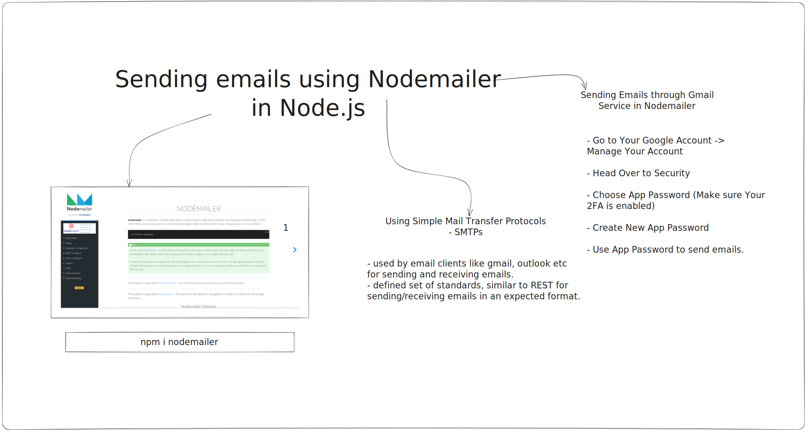

# Session 7 - Sending Emails Using Node.js

<p align="center">
    
</p>

## Introduction

This session will guide you through sending emails programmatically using Node.js and the Nodemailer library. Email communication is an integral part of most applications, and learning to send emails using Node.js can be a valuable skill for developers.

## What is Simple Mail Transfer Protocol (SMTP)?

**Simple Mail Transfer Protocol (SMTP)** is the standard protocol for sending emails across the internet. It defines the rules and conventions for communication between mail servers and is widely used for sending and receiving emails.

## Nodemailer - Installation and Usage

[Nodemailer](https://nodemailer.com/) is a powerful Node.js module that simplifies email sending. To use it, follow these steps:

### Installation

```bash
npm install nodemailer
```

### Usage

```javascript
const nodemailer = require('nodemailer');

// Create a transporter object
const transporter = nodemailer.createTransport({
  service: 'gmail',
  auth: {
    user: 'your-email@gmail.com',
    pass: 'your-app-password', // Use an App Password for Gmail
  },
});

// Define email data
const mailOptions = {
  from: 'your-email@gmail.com',
  to: 'recipient-email@example.com',
  subject: 'Subject of the Email',
  text: 'Email content in plain text',
};

// Send email
transporter.sendMail(mailOptions, (error, info) => {
  if (error) {
    console.error('Error sending email:', error);
  } else {
    console.log('Email sent:', info.response);
  }
});
```

## Getting Started

Before proceeding with this session, you need to set up the necessary environment variables and generate an App Password from Google. Here's how:

1. **Create an `.env` file**: Create a file named `.env` in your project directory to store environment variables. Add the following lines to it:

```
EMAIL_USER=your-email@gmail.com
EMAIL_PASS=your-app-password
```

2. **Generate Google App Password**: To securely send emails via Gmail, you need to create an [App Password](https://support.google.com/accounts/answer/185833?hl=en) from your Google Account settings. This password will replace your regular Gmail password in your `.env` file.

## Resources

- [Nodemailer Documentation](https://nodemailer.com/)
- [Google App Passwords](https://support.google.com/accounts/answer/185833?hl=en)
