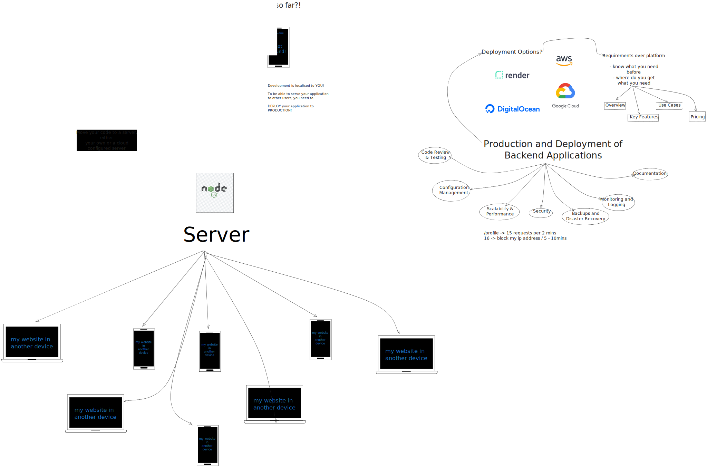

# Session 8 - Production & Deployment of Backend Applications

    

## Topic 1: Pre-deployment practices and checklist

Before deploying a backend application, it's crucial to go through a series of pre-deployment practices and use a checklist to ensure a smooth deployment process. Here are some key practices and items to include in your pre-deployment checklist:

### 1. Code Review and Testing

- **Code Review:** Collaborate with your team to review the code thoroughly. Ensure that it follows best practices and coding standards.
- **Unit Testing:** Run unit tests to catch bugs and errors early in the development process.
- **Integration Testing:** Test the interactions between different components of your application.

### 2. Configuration Management

- **Environment-specific Configurations:** Ensure that your application can adapt to different environments (development, staging, production) using configuration files.
- **Secrets Management:** Safely store and manage sensitive information such as API keys, database credentials, and tokens.

### 3. Scalability and Performance

- **Scalability Plan:** Determine how your application will handle increased loads. Consider horizontal scaling, load balancing, and caching strategies.
- **Performance Testing:** Measure your application's performance under various loads to identify bottlenecks.

### 4. Security

- **Security Auditing:** Conduct a security audit to identify and address potential vulnerabilities.
- **Authentication and Authorization:** Implement robust authentication and authorization mechanisms.
- **Data Encryption:** Ensure data is encrypted in transit and at rest.

### 5. Backups and Disaster Recovery

- **Regular Backups:** Set up automated backup solutions for databases and critical data.
- **Disaster Recovery Plan:** Have a plan in place to recover your application in case of unexpected outages.

### 6. Monitoring and Logging

- **Monitoring Tools:** Implement monitoring solutions to track the health and performance of your application.
- **Logging:** Implement comprehensive logging to help diagnose issues and troubleshoot errors.

### 7. Documentation

- **API Documentation:** Create clear and up-to-date documentation for your APIs.
- **Deployment Documentation:** Document the deployment process, including dependencies and configurations.

## Topic 2: Hosting Options (Render, GCP, AWS, Digital Ocean)

When it comes to hosting backend applications, you have several options. Each option has its strengths and use cases. Here's an overview of hosting providers you can consider:

### 1. Render

- **Overview:** Render is a modern cloud platform that simplifies the deployment process.
- **Key Features:** Automatic scaling, one-click SSL, and a straightforward setup process.
- **Use Cases:** Well-suited for web applications, APIs, and static sites.
- **Pricing:** Offers a generous free tier with competitive pricing for scaling.

### 2. Google Cloud Platform (GCP)

- **Overview:** GCP provides a wide range of cloud services, including hosting solutions.
- **Key Features:** Scalability, robust infrastructure, and integration with other GCP services.
- **Use Cases:** Suitable for large-scale applications, microservices, and data-intensive workloads.
- **Pricing:** Flexible pricing options based on usage.

### 3. Amazon Web Services (AWS)

- **Overview:** AWS is one of the largest and most comprehensive cloud platforms.
- **Key Features:** Extensive service offerings, global reach, and strong security features.
- **Use Cases:** Ideal for enterprises, startups, and applications requiring high availability.
- **Pricing:** Offers a pay-as-you-go model with various pricing plans.

### 4. DigitalOcean

- **Overview:** DigitalOcean specializes in cloud infrastructure for developers.
- **Key Features:** Simplicity, developer-friendly tools, and competitive pricing.
- **Use Cases:** Great for developers, startups, and small to medium-sized applications.
- **Pricing:** Transparent and affordable pricing with a range of droplet sizes.

## Topic 3: Hosting Using Render

Now, let's dive deeper into hosting your backend application using Render:

### Setting Up on Render

- **Create an Account:** Sign up for a Render account if you don't have one.
- **Add a New Web Service:** Configure your backend application as a web service on Render.
- **Environment Variables:** Add environment variables for configurations and secrets.
- **Database Integration:** Integrate your backend with databases or other services as needed.
- **Automatic Deployments:** Set up automatic deployments from your Git repository.

### Deployment

- **Git Integration:** Link your Git repository (e.g., GitHub, GitLab) to Render for continuous deployment.
- **Custom Domains:** Configure custom domains for your application.
- **SSL Certificates:** Enable SSL for secure connections.
- **Scaling:** Define scaling options based on your application's needs.

### Maintenance and Monitoring

- **Logs:** Access logs and view real-time performance metrics.
- **Scaling Adjustments:** Monitor your application's performance and make scaling adjustments as necessary.
- **Backups and Restores:** Implement backup and restore strategies for data durability.
